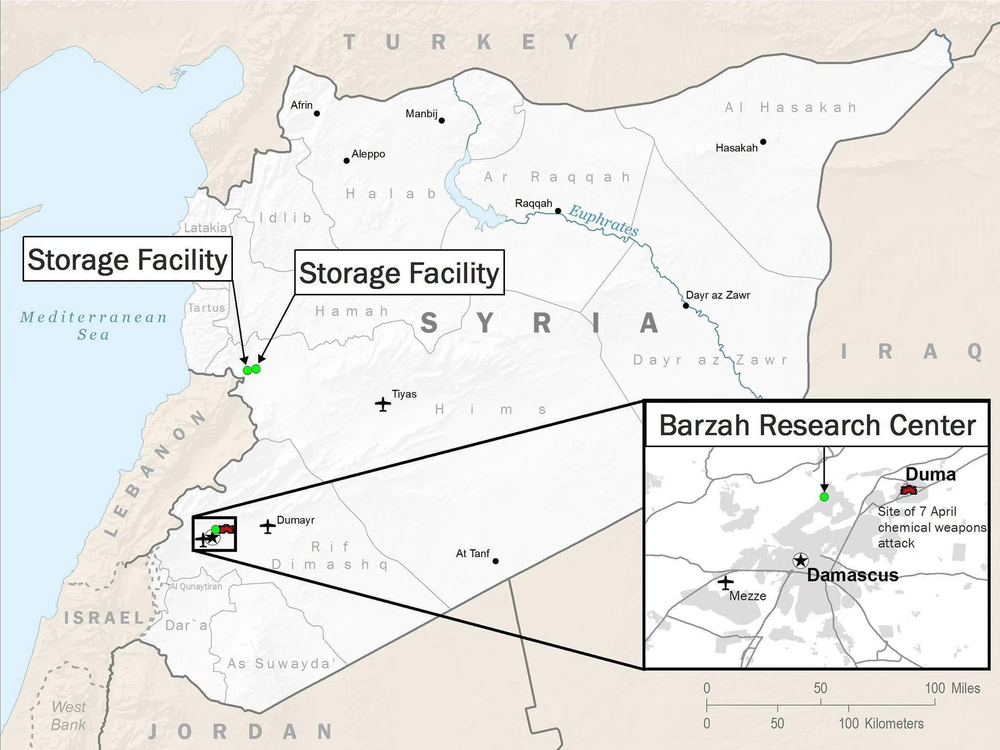

# Virt

## Layout

```bash
$ tree . -dL 1
.
├── assets
├── images
├── scripts
└── storage

4 directories
```

## AKA



[Source](https://www.independent.co.uk/news/world/middle-east/syria-air-strikes-bombing-locations-map-missiles-targets-britain-us-france-a8304531.html)
